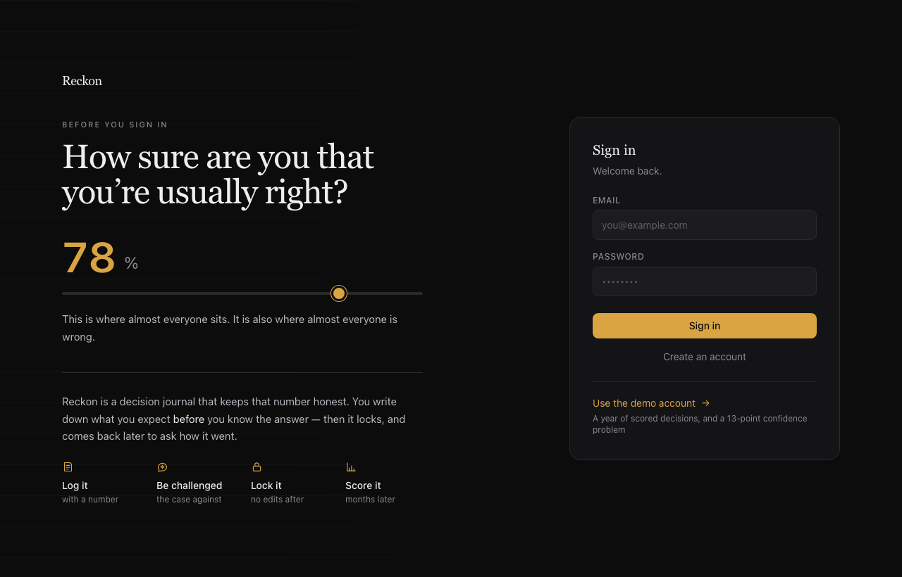
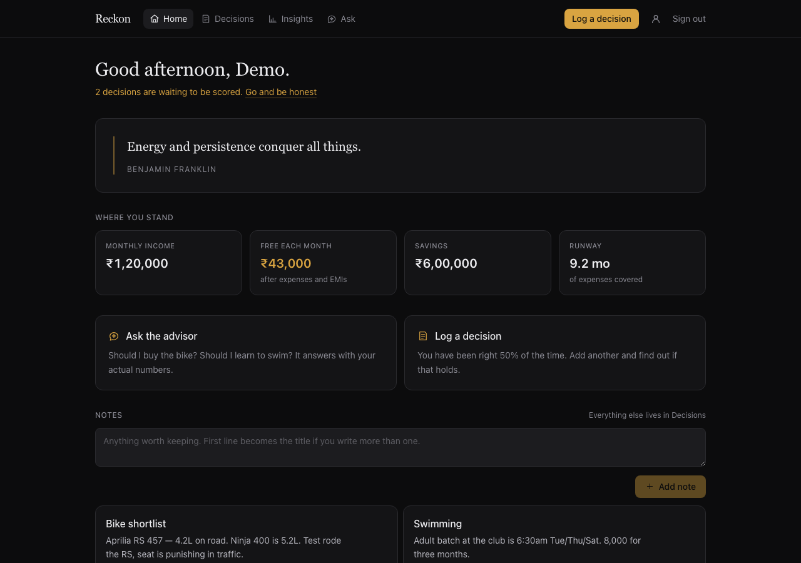
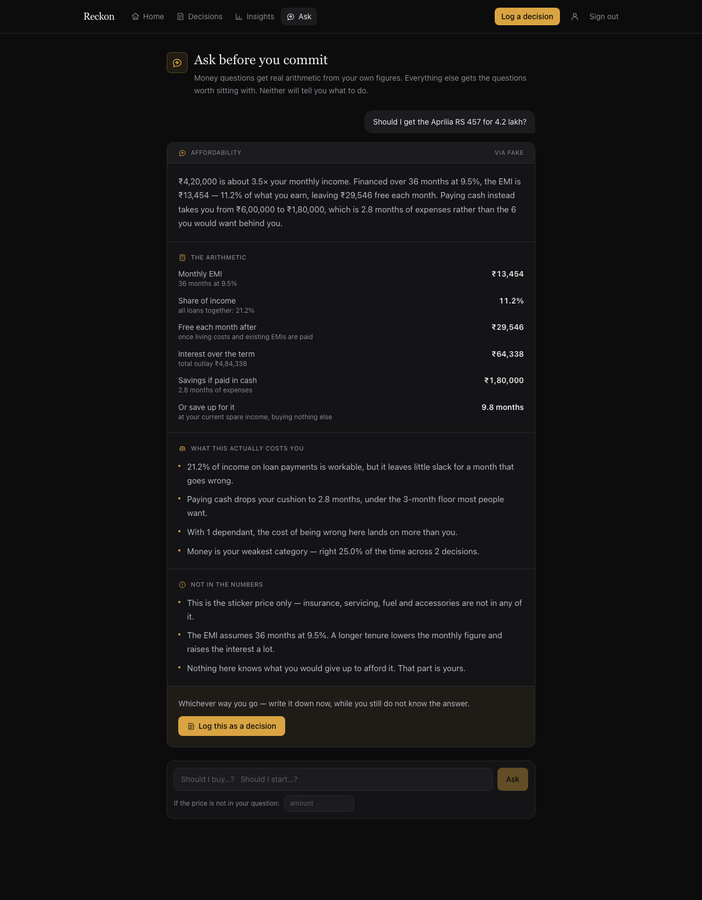
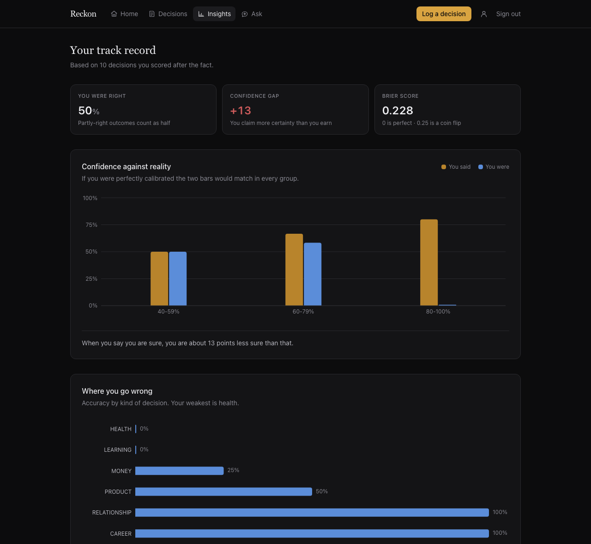
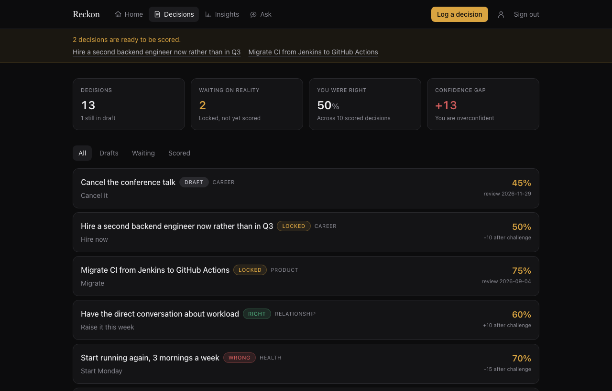

# Reckon

A decision journal that keeps you honest about your own predictions.

You log a decision *before* you make it, along with how confident you are.
An AI argues the opposite case and you get one chance to revise that number.
Then the decision locks — permanently. Weeks later the app asks what actually
happened, and over time it shows you the gap between how sure you felt and how
often you were right.

## What's in it

**Home** — your profile at a glance, a quote that changes daily, and notes.
**Ask** — one advisor. Money questions get real arithmetic from your own figures; anything else gets the questions worth sitting with. Every answer can be logged as a decision in one click.
**Decisions** — the journal below, where predictions get locked and scored.
**Insights** — how well-calibrated you actually turned out to be.

## The loop

1. **Log** a decision: what you're deciding, why, what you expect, and a confidence score of 0–100.
2. **Get challenged.** A background job asks the AI for the strongest case against you — counterarguments, blind spots, and the specific conditions under which this fails. You may revise your confidence once. Both numbers are kept.
3. **Lock it.** After this the record is immutable. No editing your reasoning once you know the answer.
4. **Wait.** A scheduled job raises a notification when the review date arrives.
5. **Score it.** What happened, and were you right?
6. **See the pattern.** A calibration chart of claimed confidence against actual hit rate, broken down by category — plus whether arguing with the AI actually made you better calibrated or merely less confident.

## What it looks like

**The front door asks a question before it asks for your password.** Drag the slider and it answers back — the same control you use on every decision inside.



**Home** — where you stand financially, a quote that changes daily, and notes.



**Ask** — the advisor on a real question. The EMI, what share of income it is, what paying cash does to the emergency fund, and how long saving up would take. Every figure here is computed in Python from the profile and handed to the model; none of it is generated text. It ends by offering to log the whole thing as a decision.



**Insights** — claimed confidence against what actually happened. The demo account says 80–100% and is right 0% of the time in that bucket, which is the entire point of the app in one bar.



**Decisions** — the journal. Each row shows the confidence that was locked in, and how far the challenge moved it.



## Project structure

Two peers under one repo — the API and the client are separate applications that
happen to live together, not one nested inside the other.

```
reckon/
├── backend/            Django 5 + DRF
│   ├── reckon/         project: settings, celery, ai/ providers
│   ├── accounts/       auth
│   ├── profiles/       personal + financial details, affordability maths
│   ├── decisions/      the journal: decisions, challenges, reviews, tasks
│   ├── advisor/        the assistant
│   ├── insights/       calibration calculations (no models of its own)
│   ├── notes/          notes
│   ├── home/           the home screen aggregate
│   └── manage.py
├── frontend/           React + Vite + Tailwind
│   └── src/            api.js, auth.jsx, components/, pages/
├── screenshots/
└── dev.sh              runs all four processes
```

## Stack

Django 5 + DRF + Postgres + Celery/Redis on the backend, React + Vite + Tailwind on the front.
No Docker, no cloud services, no paid APIs required to run it.

## Running it locally

Prerequisites: Python 3.12, Node 20+, PostgreSQL and Redis running locally.

```bash
# One-time setup
cd backend
python3.12 -m venv reckon_venv
./reckon_venv/bin/pip install -r requirements.txt
createdb reckon_dev            # or: psql -U postgres -c "CREATE DATABASE reckon_dev"
./reckon_venv/bin/python manage.py migrate
./reckon_venv/bin/python manage.py seed_demo
cd ../frontend && npm install && cd ..

# Then, from the repo root — API, Celery worker, Celery beat and the frontend
./dev.sh

# Short on memory? Two processes instead of four, tasks run inline
./dev.sh light
```

Open http://localhost:5173 and sign in with **demo@reckon.local / reckon123**,
or register a fresh account.

Prefer not to run a Celery worker? `./dev.sh light` sets `CELERY_TASK_ALWAYS_EAGER=True`
for you, so tasks execute inside the request and no worker, beat or Redis is needed.
Handy on a laptop with 8&nbsp;GB of RAM, where four Python processes plus Vite is a squeeze.

## The AI is pluggable

`backend/reckon/ai/` defines one interface (`AIProvider`) with two implementations:

- **`fake`** (default) — runs offline, needs no API key, costs nothing. Output is seeded from the decision's UUID, so it's deterministic and safe for tests and demos.
- **`anthropic`** — the real thing, via the Claude API.

Switching between them is a settings change, never a code change:

```bash
AI_PROVIDER=anthropic
ANTHROPIC_API_KEY=sk-ant-...
```

## API

All endpoints require `Authorization: Bearer <access_token>` except register and login.

| Method | Path | What it does |
|---|---|---|
| POST | `/api/auth/register/` | Create an account, returns tokens |
| POST | `/api/auth/login/` | Returns tokens |
| GET | `/api/auth/me/` | Current user |
| GET | `/api/decisions/` | List, filterable by `status` and `category` |
| POST | `/api/decisions/` | Create a draft |
| GET | `/api/decisions/<uuid>/` | One decision with its challenge and review |
| PATCH | `/api/decisions/<uuid>/` | Edit — drafts only |
| DELETE | `/api/decisions/<uuid>/` | Soft delete |
| POST | `/api/decisions/<uuid>/challenge/` | Queue the devil's advocate, returns `202` |
| PATCH | `/api/decisions/<uuid>/confidence/` | Revise confidence, once, before locking |
| POST | `/api/decisions/<uuid>/lock/` | Freeze the record |
| POST | `/api/decisions/<uuid>/review/` | Score the outcome |
| GET | `/api/decisions/notifications/` | Review-due notifications |
| PATCH | `/api/decisions/notifications/<uuid>/read/` | Mark one read |
| GET | `/api/insights/track-record/` | Accuracy, calibration gap, Brier score, buckets, category breakdown |
| GET | `/api/home/` | Everything the home screen needs, in one request |
| GET | `/api/profile/` | Your details |
| PATCH | `/api/profile/` | Update them |
| GET | `/api/notes/` | Notes, pinned first |
| POST | `/api/notes/` | Create one |
| PATCH | `/api/notes/<uuid>/` | Edit or pin |
| DELETE | `/api/notes/<uuid>/` | Soft delete |
| GET | `/api/advisor/` | Conversation history |
| POST | `/api/advisor/` | Ask a question |

Errors come back in one shape everywhere:

```json
{"error_code": "DECISION_LOCKED", "message": "...", "details": {}}
```

## Background jobs

| Task | Trigger | What it does |
|---|---|---|
| `decisions.tasks.generate_challenge` | On demand, from the challenge endpoint | Calls the AI provider and stores the result |
| `decisions.tasks.raise_due_reviews` | Celery beat, every 30 min | Creates a notification for every locked decision whose review date has arrived. Idempotent — a unique constraint means re-running it is harmless. |

## How the advisor works

`POST /api/advisor/` classifies the question into one of three shapes:

- **Money** — it parses an amount out of plain English (`"4.2 lakh"`, `"₹4,20,000"`, `"50k"`), then `backend/profiles/utils.py` computes the EMI, what share of income that is, what paying cash does to the emergency fund, and how long saving up would take. **That arithmetic runs in Python and is handed to the AI provider**, so no model ever invents a figure. You can override the parsed amount if it guesses wrong.
- **Track record** — answered from the calibration numbers in `insights/`.
- **Everything else** — the questions that make a vague plan falsifiable.

Money questions are refused with `PROFILE_REQUIRED_FOR_MONEY` until income, expenses and savings are filled in — an answer without them would be a guess wearing a number.

The advisor lays out the trade-off and never issues a verdict. It is affordability arithmetic and things to weigh, not financial advice.
